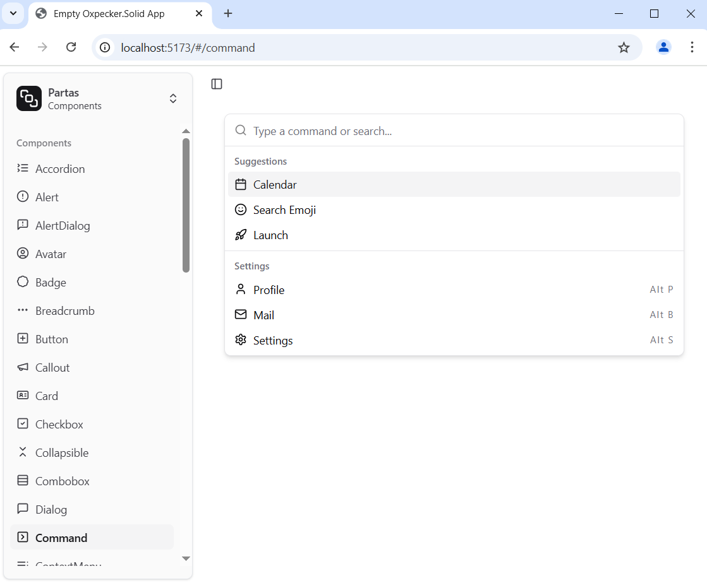

# Partas.Solid.UI

[//]: # (
)

[//]: # (
)

> [!IMPORTANT]
> This library is being moved to [Partas.Solid.UIKit](https://github.com/shayanhabibi/Partas.Solid.UIKit)

Port of [Solid-ui](https://solid-ui.com/) in Partas.Solid and other components/effects.

> Build the playground with `npm run start`

## Usage

Like shadcn and solid-ui, the components are made to be copy pasted into your own projects to make your own component library.

All you'll need is the code in the Utils file, and then you can copy paste any of the components and use them. Just make sure to `femto install` the necessary bindings.

## Technologies used

- Tailwindcss v4
- Kobalte
- Corvu (for the OTP fields)
- ArkUI (for the datepicker)
- Sonner
- Motion
- Lucide
- solid-cmdk
- Apex Charts
